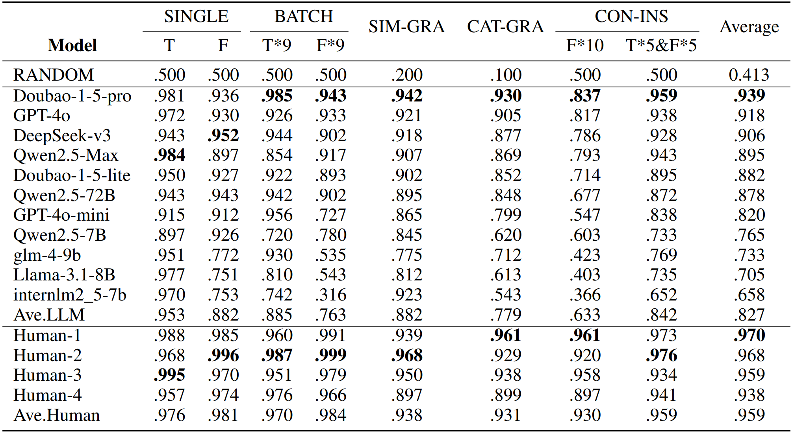

<p align="center">
    <a href="https://github.com/wd-github-2017/CPG-EVAL/blob/main/README.md">English | <a href="https://github.com/wd-github-2017/CPG-EVAL/blob/main/README_zh.md">中文</a>
</p>

[Wang(2025)](https://arxiv.org/abs/2504.13261/) proposes a low-cost and efficient method for rapidly constructing specialized multi-tiered benchmarks to assess LLMs' knowledge of pedagogical grammar. Furthermore, [Wang(2025)](https://arxiv.org/abs/2504.13261/) put this method into practice by establishing the first dedicated benchmark specifically designed to evaluate LLMs’ understanding of pedagogical grammar, named the Chinese Pedagogical Grammar Evaluation (CPG-EVAL). In addition, we conducted tests involving both LLMs and human participants. 

## Contents
- [Leaderboard](#Leaderboard)
- [CPG-EVAL Question Bank](#CPG-EVAL-Question-Bank)
- [Licenses](#licenses)
- [Citation](#Citation)
    
## Leaderboard
    Below is the zero-shot accuracy of various models evaluated using the most recent version of the question bank.
<p align="center">        </p>

Model results are based on the full CPG-EVAL question bank, while human results are derived from the streamlined CPG-EVAL: lite question bank. For more experimental details, please refer to [Wang(2025)](https://arxiv.org/abs/2504.13261/)

## CPG-EVAL Question Bank
- CPG-EVAL

    The full version of CPG-EVAL contains 43,888 items, encompassing all pedagogical grammar points from elementary to advanced levels as specified in *Chinese Proficiency Grading Standards for International Chinese Language Education Grammar Learning Manual*.


- CPG-EVAL: lite

    The streamlined CPG-EVAL: lite consists of 5,930 items, selected through stratified sampling from the full CPG-EVAL. Each question has been manually reviewed by teachers of Chinese as a foreign language to ensure that the answers are professionally unambiguous.
    
## Licenses
- This project is released under the [MIT License](https://lbesson.mit-license.org/).
- The CPG-EVAL and CPG-EVAL: lite datasets are distributed under the [CC BY-NC-SA 4.0](http://creativecommons.org/licenses/by-nc-sa/4.0/) license.

[](https://lbesson.mit-license.org/)
[](http://creativecommons.org/licenses/by-nc-sa/4.0/)

## Citation
If you use this dataset or refer to [Wang(2025)](https://arxiv.org/abs/2504.13261/)to construct benchmarks for other instructional scenarios, please cite the following paper:

```
@article{wang2025CPGEVALMultitieredBenchmark,
  title = {{{CPG-EVAL}}: A Multi-Tiered Benchmark for Evaluating the Chinese Pedagogical Grammar Competence of Large Language Models},
  author = {Wang, Dong},
  year = {2025},
  publisher = {arXiv},
  doi = {10.48550/ARXIV.2504.13261}
}
```