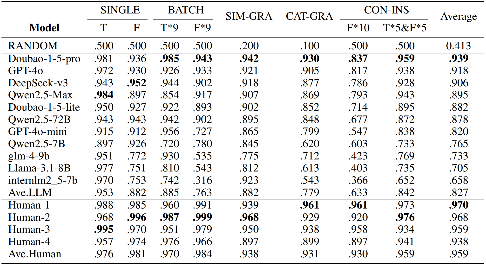

<p align="center">
    <a href="https://github.com/wd-github-2017/CPG-EVAL/blob/main/README.md">English | <a href="https://github.com/wd-github-2017/CPG-EVAL/blob/main/README_zh.md">中文</a>
</p>


[Wang(2025)](https://arxiv.org/abs/2504.13261/) 提出了一种低成本且高效的方法，用于快速构建多层级的专项基准测试，以评估大语言模型（LLM）对教学语法知识的掌握。并且，[Wang(2025)](https://arxiv.org/abs/2504.13261/)将这种方法付诸实践，建立了首个专门评估大语言模型教学语法理解能力的基准数据集——对外汉语教学语法评测（CPG-EVAL）。此外，我们还对大语言模型和人类参与者进行了相关测试。

## 目录
- [排行榜](#排行榜)
- [CPG-EVAL的题库](#CPG-EVAL的题库)
- [Licenses](#licenses)
- [引用](#引用)
    
## 排行榜

    下面列出我们使用最新版本题库对模型进行评估后的zero-shot准确率。
    
<p align="center">        </p>

模型结果基于完整版CPG-EVAL题库，人类结果基于精简版CPG-EVAL: lite题库。更多实验细节请参考 [Wang(2025)](https://arxiv.org/abs/2504.13261/)

## CPG-EVAL的题库
- CPG-EVAL

    完整版CPG-EVAL由43,888题构成，覆盖《国际中文教育中文水平等级标准·语法学习手册》初等到高等的所有教学语法点。

- CPG-EVAL: lite

    精简版CPG-EVAL: lite由5,930题组成，通过对完整版CPG-EVAL进行分层抽样得出。每个题目都经过对外汉语教育教师的人工审核，确保答案在专业角度不产生争议。
    
## Licenses
- 项目遵循 [MIT License](https://lbesson.mit-license.org/).
- CPG-Eval以及CPG-EVAL: lite数据集遵循 [CC BY-NC-SA 4.0](http://creativecommons.org/licenses/by-nc-sa/4.0/).

[](https://lbesson.mit-license.org/)
[](http://creativecommons.org/licenses/by-nc-sa/4.0/)

## 引用
如果您使用了本数据集，或者参考 [Wang(2025)](https://arxiv.org/abs/2504.13261/)构建了针对其他教学场景的基准测试，请引用论文。

```
@article{wang2025CPGEVALMultitieredBenchmark,
  title = {{{CPG-EVAL}}: A Multi-Tiered Benchmark for Evaluating the Chinese Pedagogical Grammar Competence of Large Language Models},
  author = {Wang, Dong},
  year = {2025},
  publisher = {arXiv},
  doi = {10.48550/ARXIV.2504.13261}
}
```